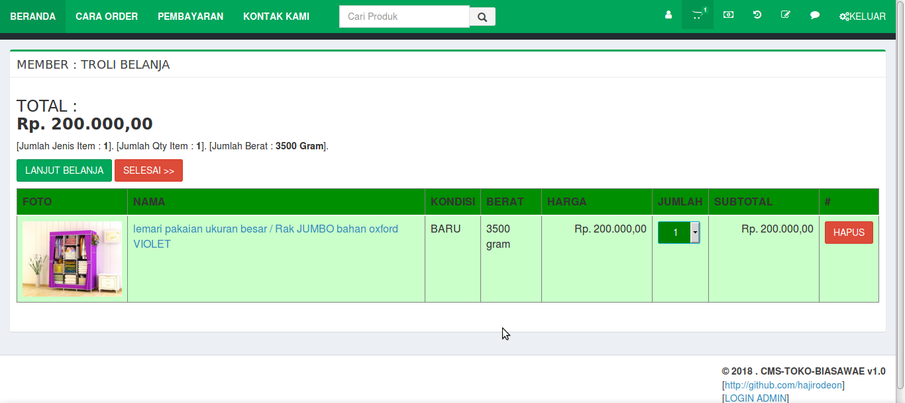
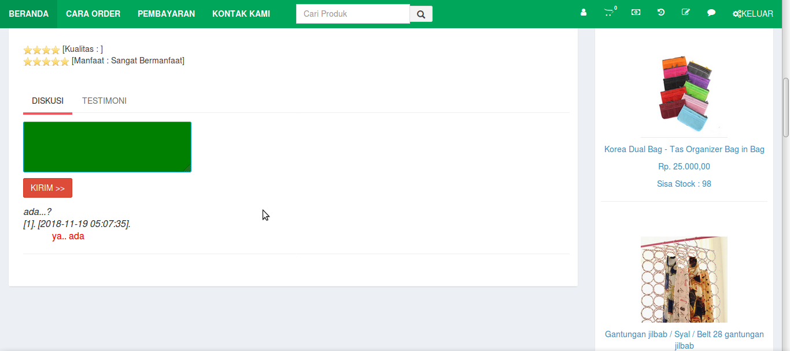
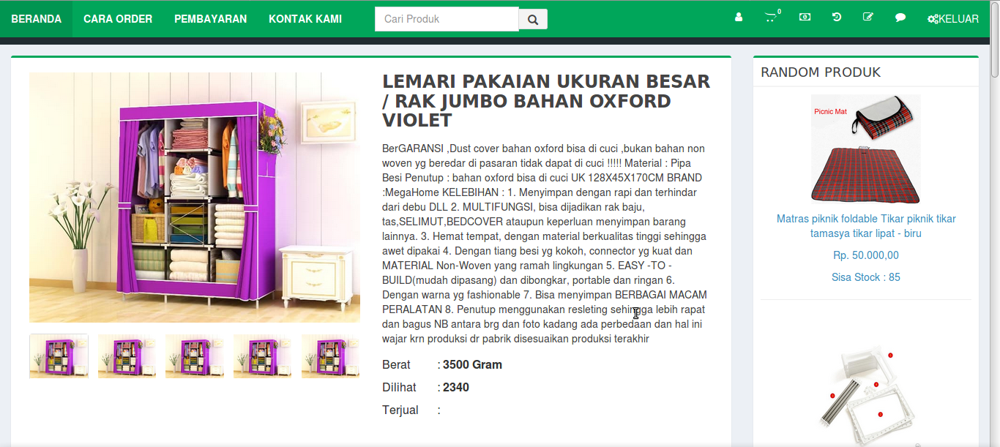
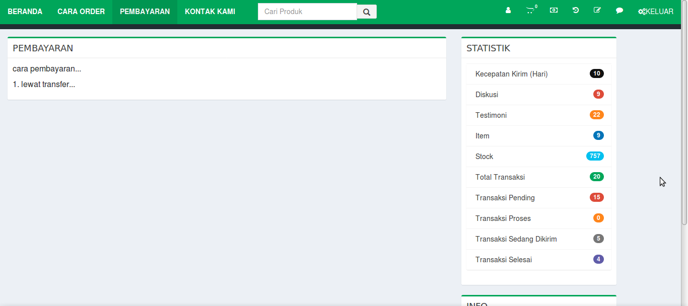
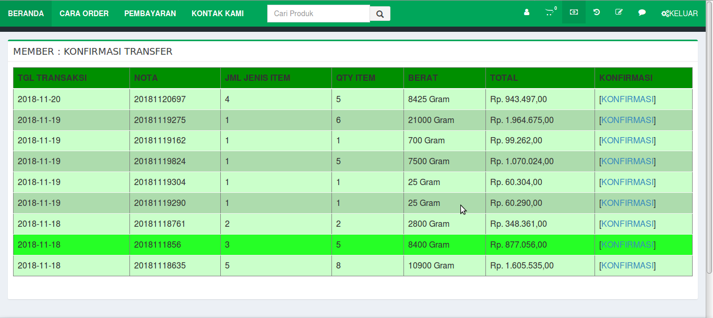
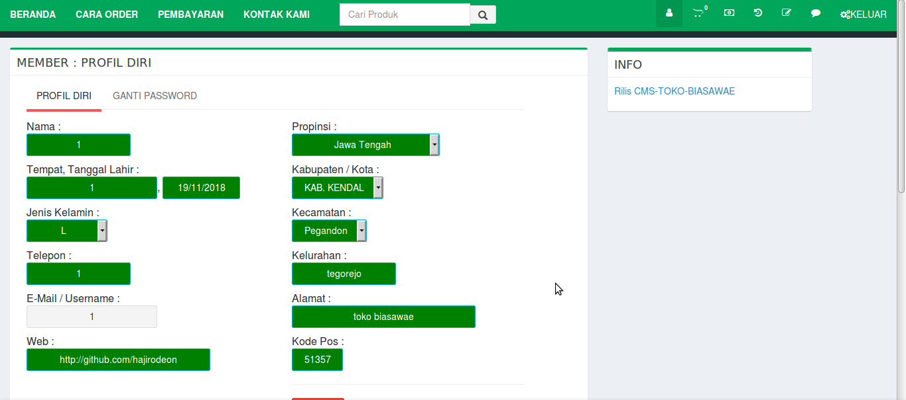
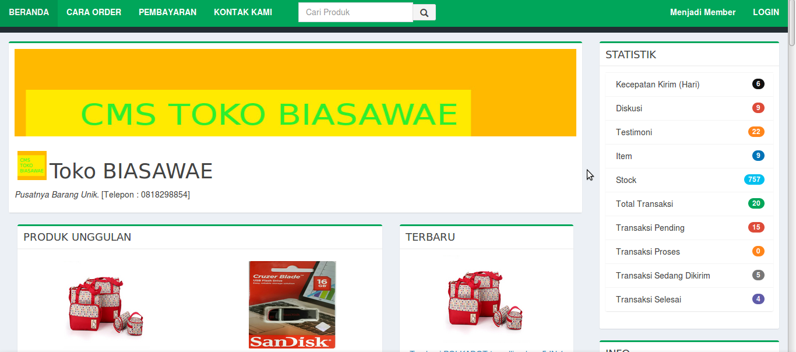
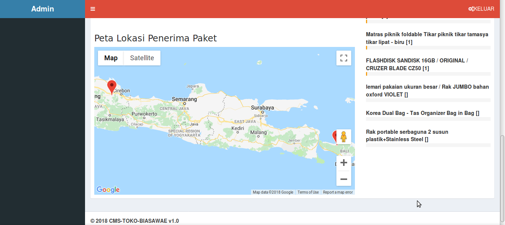
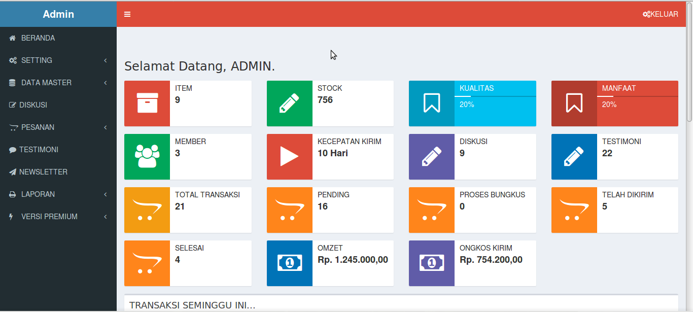
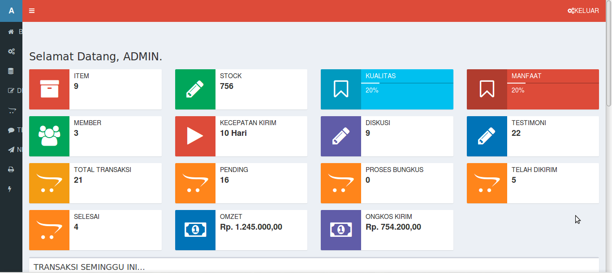

# cms-toko-biasawae

CMS-TOKO-BIASAWAE v1.0 (Code : Daun Muda). 2018.

Cocok untuk digunakan untuk membuat web toko online kamu.

Sementara hanya cocok dengan PHP 5.6.30 dan MySQL.

---

Berikut beberapa fitur dari CMS-TOKO-BIASAWAE v1.0 (Code : Daun Muda) 

<ul>

  <li>Otomatis hitung ongkos kirim JNE/POS/TIKI/JNT</li>

  <li>Member bisa ikut diskusi untuk suatu Item</li>
  
  <li>Member bisa menuliskan testimoni untuk tiap Item yang telah selesai transaksinya atau telah diterima paketnya</li>
  
  <li>Konfirmasi Transfer mudah dilakukan. Hanya cukup memilih transaksi yang belum dibayar</li>
  
  <li>Statistik Toko lebih detail, dan bisa diketahui oleh para Member</li>
  
  <li>Peta Lokasi Penerima Paket bisa diketahui oleh admin</li>
  
  <li>dan masih banyak fitur lainnya... </li>
  
 
</ul>

---

Cara Instalasi 

<ol>
  <li>Siapkan Webserver. Misalkan Xampp php 6.5.30</li>
  
  <li>Salin semua isi paket zip CMS-TOKO-BIASAWAE ini, ke folder /www atau /htdocs, webserver kamu</li>
  
  <li>Jalankan PHPMyAdmin WebServer Kamu. Buatlah sebuah database. Kemudian import file .sql dari folder /db</li>
  
  <li>Silahkan konfigurasi koneksi database dan path situs-nya, pada file /inc/config.php</li>
  
  <li>Kalau sudah, jalankan browser dengan alamat http://localhost</li>
  
</ol>

---

Contoh Akses Admin :

User/Pass : admin

---

Contoh Akses Member :

User/Pass : 1

demo bisa dicoba juga di :

http://tekniknih.com/demo/cms-toko-biasawae-demo/

---

Contoh Tampilan

